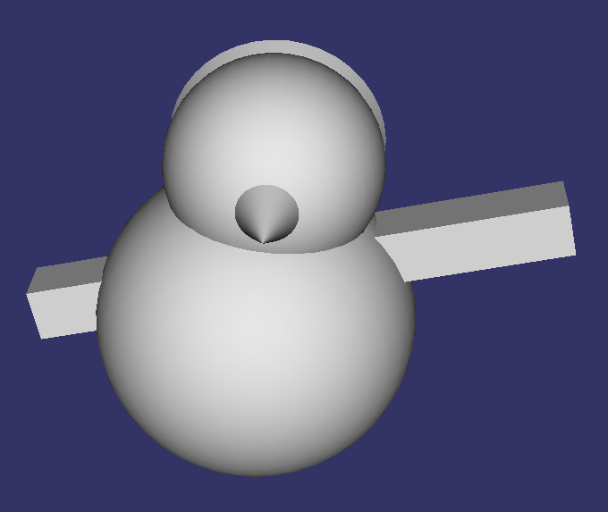

#Rapport de TP OpenSceneGraph
***Par Willis Pinaud & Eric Lalevé***

##Découverte de OSG


###Les commandes:
**<kbd>S</kbd>**: 
- Frame rate
- Utilisation de la mémoire
- Objets, lumieres etc. qui ont été crées
- Nombre de noeuds

**<kbd>W</kbd>**:
- Mode fil de fer
- Mode normal
- Mode points

**<kbd>L</kbd>**:
- Active et desactive les lumieres

**<kbd>F</kbd>**:
- Switch full screen

###Librairies:
- osgViewer
- osgDB
- osg
- osgGA
- OpenThreads

###Graph de scene:


###Graph de scene avec 4 primitives:



###Graph de scene avec de la couleur:


##Ajout des matières

###Graph de scene avec plusieurs objets Drawable:

```c++
osg::ref_ptr<osg::Material> myMaterial (new osg::Material());
myMaterial->setEmission(osg::Material::FRONT,osg::Vec4f(0.93f,0.12f,0.031f,1.0f));
myMaterial->setAmbient(osg::Material::FRONT,osg::Vec4f(0.0f,1.0f,1.0f,1.0f));
myMaterial->setShininess(osg::Material::FRONT,0.0);
```


##Positionnement


###Graph de scene avec le même objet Drawable:
```
Modifier la position de certains éléments de la scène.
• Afficher le même objet Drawable plusieurs fois avec des matières différentes,
avec plusieurs Geode, un StateSet et un PAT associé aux nœuds Geode.
• Donner le nouveau graphe de scène.
```


Le noeud MatrixTransform permet de réalisé les mêmes actions que le noeud PAT mais est plus souple car il permet l'application directe d'une matrice de transformation.
De plus, il doit aussi être plus rapide.


##Chargement d'objets et mise à l'échelle

```c
/* TERRAIN */
// Create transformation node
osg::ref_ptr<osg::MatrixTransform> terrainScaleMAT (new osg::MatrixTransform);
```
Le terrain est mis à l'échelle à l'aide d'une matrice de transformation générée directement à l'aide de la fonction ```makeScale```sur le noeud de type ```MatrixTransform```

```c
// Scale matrix
osg::Matrix terrainScaleMatrix;
terrainScaleMatrix.makeScale(osg::Vec3f(0.5f,0.5f,0.5f));
//Loading the terrain node
osg::ref_ptr<osg::Node> terrainnode (osgDB::readNodeFile("/Users/willispinaud/Dropbox/OpenSceneGraphIni/TP_Osg/TP_Osg/Terrain2.3ds"));
//Set transformation node parameters
terrainScaleMAT->addChild(terrainnode);
terrainScaleMAT->setMatrix(terrainScaleMatrix);
```
**Objet dans la scène mis à l'échelle:**

**Nouveau graphe de scène:**


##Ajout des textures
**Bonhomme de neige texturé:**
On a ajouté de la neige.


##Ajout des lumières


**Deux lumières difféentes dans la scène.:**


**Nouveau graphe de scène:**
```
osg::Group (root)
  osg::Geode
    osg::ShapeDrawable
    osg::ShapeDrawable
    osg::ShapeDrawable
  osg::PositionAttitudeTransform
    osg::Geode
      osg::ShapeDrawable
      osg::ShapeDrawable
  osg::MatrixTransform
    osg::MatrixTransform
      osg::MatrixTransform
        osg::Geode
          osg::Geometry
  osg::Group (lightGroup)
    osg::LightSource
    osg::LightSource
    osg::Geode
      osg::ShapeDrawable
      osg::ShapeDrawable
```

##Brouillard
```c++
    osg::ref_ptr<osg::Fog> fog = new osg::Fog;
    fog->setColor(osg::Vec4(0.1,0.4,0.9,0.9));
    fog->setMode( osg::Fog::EXP2 );
    fog->setDensity( 0.1f );
    fog->setStart(20);
    fog->setEnd(10);
    osg::ref_ptr< osg::StateSet> fogSS (new osg::StateSet);
    fogSS->setAttributeAndModes( fog.get(), osg::StateAttribute::ON );
    fogSS->setMode( GL_FOG, osg::StateAttribute::ON );
    root->setStateSet(fogSS);
```
**Exemples avec  ```osg::fog``` :**

**Graph de scène:**
Le graph de scene ne change pas car on ne fait qu'ajouter un stateSet à la racine, ou sur le noeud où l'on veut appliquer le brouillard.

#Construction d'une scène
##Jeu de Dames

1. Les Pions


Ce sont de simples cylindres adaptés à la taille de la table de jeu.

2. La table de jeu


Une box fine.

3. Avec des textures

  1. Les Pions


  2. La table de jeu


4. Dans un environnement


6. Graph de scène


#Construction d'une scène animée
```
Créer une scène animée (AnimationPathCallBack ou autre callback).
Créer une scène animée avec une articulation entre plusieurs objets (AnimationPathCallBack ET autre callback).
Représenter les graphes de scene.
```
4. Animation de déplacement des pions

  5. Déplacer un pion sur une case vide

        Méthode:
        
        
  

  6. Manger un pion adverse
        - Méthode 1:

          

        - Méthode 2:

          


#Modélisation de phénomène physique
```
• Ajouter un modele physique pour calculer le comportement d'un objet en mouvement.
• Visualiser une grandeur associée a cet objet.
• Représenter le graphe de scene.
```
0. Modele physique
1. Implémentation
1. Un mur de brique ?
2. Lancé de balle dans le mur de brique ?


